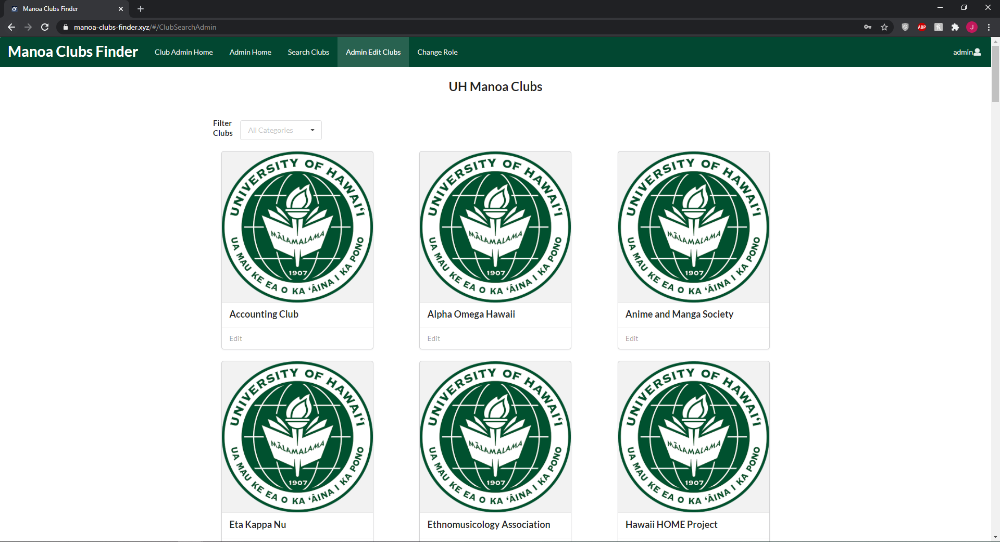
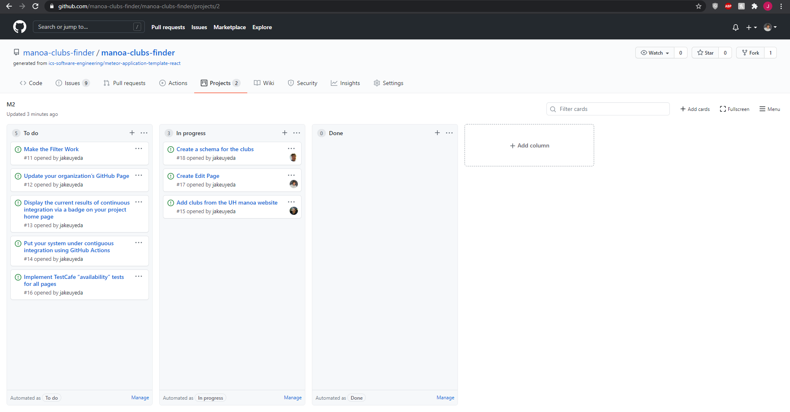

## Table of contents

* [Overview](#overview)
* [User Guide](#user-guide)
* [Community Feedback](#community-feedback)
* [Developer Guide](#developer-guide)
* [Development History](#development-history)
* [Contact Us](#contact-us)


## Overview

Manoa Clubs Finder is a web application that provides a centralized directory for UH Manoa student clubs. UH Manoa students can login to browse a well organized directory of all current student clubs, with brief descriptions, meeting times and locations, URLs to their websites (if any), contact information for officers, and a few select photos.

Manoa Clubs Finder has three user roles, all of whom login with their UH ID. Regular users browse the directory. Club Admins have the ability to edit the data associated with their club. Super Admins make sure site content is appropriate and grant “club admin” privileges to selected users.

Users can sort through all the clubs using catagories or keywords and can specify interest areas, and be notified when a new club is created matching that interest area (or an existing club adds that interest area).

This web application uses information from [Student Life and Development at UH Manoa](http://www.manoa.hawaii.edu/studentlife/studentorg/rio.php) to get all the Registered Independent Organizations at UH Manoa.

## User Guide

This section provides a walkthrough of the Manoa Clubs Finder user interface and its capabilities.

### Link to Current Website

[Manoa Clubs Finder Website](https://manoa-clubs-finder.xyz/#/)

### Landing Page

The landing page is presented to users when they visit the top-level URL to the site.


### Sign in and sign up

Click on the "Login" button in the upper right corner of the navbar, then select "Sign in" to go to the following page and login. You must have been previously registered with the system to use this option:


Alternatively, you can select "Sign up" to go to the following page and register as a new user:


### Home Pages

After logging in, you are taken to the home page depending what role you have on the site. The different roles are club admin, user, and super admin.

#### Club Admin Home

When you login to this site with the club admin role, you are taken to this page. It shows you the things you can do being a club admin.


#### Super Admin Home

When you login to this site with the super admin role, you are taken to this page. It shows you the things you can do being a super admin.


#### User Home

When you login to this site with the user role, you are taken to this page. It shows you the things you can do being a user.


### Club Search

This is the page where users can view all the clubs in Manoa. You can filter the club by certain catagories.


### Admin Edit

This is the page you can view all the clubs you can edit.



### Edit Page

This is the page you can edit the club you picked.


## Community Feedback

We are interested in your experience using Manoa Clubs Finder!  If you would like, please take a couple of minutes to fill out the [Manoa Clubs Finder Feedback Form](https://docs.google.com/forms/d/e/1FAIpQLSdTZstgumOwQexxq4t9Ax4-_o3eCTdFLJ3gSHCjZxQBMfPI4Q/viewform?usp=pp_url). It contains only five short questions and will help us understand how to improve the web application.

## Developer Guide

This section provides information of interest to Meteor developers wishing to use this code base as a basis for their own development tasks.

### Installation

First, [install Meteor](https://www.meteor.com/install).

Second, visit the [Manoa Clubs Finder application github page](https://github.com/manoa-clubs-finder/manoa-clubs-finder), and click the "Use this template" button to create your own repository initialized with a copy of this application. Alternatively, you can download the sources as a zip file or make a fork of the repo.  However you do it, download a copy of the repo to your local computer.

Third, cd into the bowfolios/app directory and install libraries with:

```
$ meteor npm install
```

Fourth, run the system with:

```
$ meteor npm run start
```

If all goes well, the application will appear at [http://localhost:3000](http://localhost:3000).

### Application Design

Manoa Clubs Finder is based upon meteor-application-template-react and meteor-example-form-react. Please use the videos and documentation at those sites to better acquaint yourself with the basic application design and form processing in Manoa Clubs Finder.

### Data model

WIP

## Continuous Integration


Manoa Clubs Finder uses [GitHub Actions](https://docs.github.com/en/free-pro-team@latest/actions) to automatically run ESLint and TestCafe each time a commit is made to the default branch.  You can see the results of all recent "workflows" at [https://github.com/manoa-clubs-finder/manoa-clubs-finder/actions](https://github.com/manoa-clubs-finder/manoa-clubs-finder/actions).

The workflow definition file is quite simple and is located at
[.github/workflows/ci.yml](https://github.com/manoa-clubs-finder/manoa-clubs-finder/blob/master/.github/workflows/ci.yml).

## Development History

The development process for Manoa Clubs Finder conformed to [Issue Driven Project Management](http://courses.ics.hawaii.edu/ics314f19/modules/project-management/) practices. In a nutshell:

* Development consists of a sequence of Milestones.
* Each Milestone is specified as a set of tasks.
* Each task is described using a GitHub Issue, and is assigned to a single developer to complete.
* Tasks should typically consist of work that can be completed in 2-4 days.
* The work for each task is accomplished with a git branch named "issue-XX", where XX is replaced by the issue number.
* When a task is complete, its corresponding issue is closed and its corresponding git branch is merged into master.
* The state (todo, in progress, complete) of each task for a milestone is managed using a GitHub Project Board.

The following sections document the development history of Manoa Clubs Finder.

### Milestone 1: Mockup development

The goal of Milestone 1 was to create a set of HTML pages providing a mockup of the pages in the system.

Milestone 1 was managed using [Manoa Clubs Finder GitHub Project Board M1](https://github.com/manoa-clubs-finder/manoa-clubs-finder/projects/1):


### Milestone 2: Data model development

The goal of Milestone 2 is to implement the data model: the underlying set of Mongo Collections and the operations upon them that would support the Manoa Clubs Finder application.

Milestone 2 was managed using [Manoa Clubs Finder GitHub Project Board M2](https://github.com/manoa-clubs-finder/manoa-clubs-finder/projects/2):



### Milestone 3: Final touches

The goal of Milestone 3 was to clean up the code base and fix minor UI issues.

Milestone 3 was managed using [Manoa Clubs Finder GitHub Project Board M3](https://github.com/manoa-clubs-finder/manoa-clubs-finder/projects/3):


## Contact Us

If you have any questions or queries you can contact any of the developers below.

* Jake Uyeda (jakeu@hawaii.edu)
* Tri Pham (tripham@hawaii.edu)
* Christian Siador (cjsiador@hawaii.edu)
